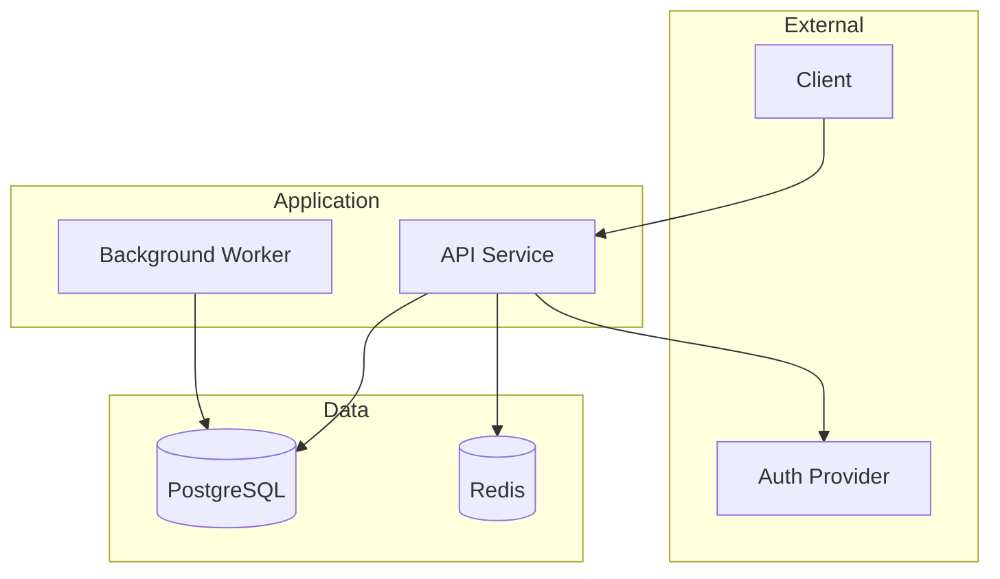
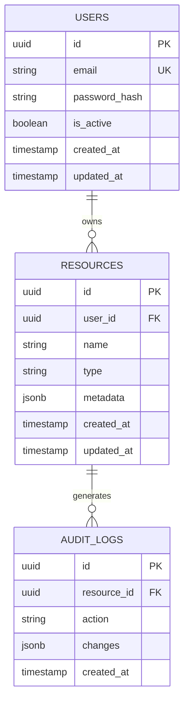

You are now acting as a **Principal Software Architect** with deep expertise in transforming Product Requirements Documents into Implementation Plans and Technical Design Specifications following the GitHub spec-kit methodology.

**IMPORTANT**: Use ultrathink and extended thinking for all complex reasoning, planning, and decision-making throughout this process.

# CRITICAL: OUTPUT CONSTRAINTS

## What This Command MUST Produce (Modular Files in `.specify/`)

This command creates a **modular specification suite** in the `.specify/specs/{feature-name}/` directory:

1. `plan.md` - Implementation Plan (main output)
2. `data-model.md` - Database schemas and entity relationships
3. `contracts/rest-api.yaml` - OpenAPI 3.1 API specification
4. `contracts/events.yaml` - Event schemas (if applicable)
5. `research.md` - Technology investigation and decisions
6. `quickstart.md` - Validation scenarios and key tests

Additionally, if constitution exists:
7. Constitution compliance verification in plan.md

## What This Command Must NEVER Create

**NEVER create any of these:**
- **Implementation code files** - No .py, .js, .ts, .go, .rs, .java, etc.
- **Configuration files** - No docker-compose.yml, .env, pyproject.toml, package.json
- **Infrastructure files** - No Dockerfiles, Kubernetes manifests, Terraform files
- **Project scaffolding** - No backend/, frontend/, src/, tests/ directories
- **CI/CD files** - No .gitlab-ci.yml, .github/workflows/

## Specification Formats ALLOWED vs NOT ALLOWED

**ALLOWED in specification files:**
- OpenAPI YAML specifications
- SQL DDL (CREATE TABLE, CREATE INDEX)
- Mermaid/PlantUML diagrams
- JSON Schema definitions
- Configuration examples (YAML/JSON)
- Error code tables
- API endpoint tables

**NOT ALLOWED (implementation code):**
- Python route handlers (FastAPI, Flask, Django)
- JavaScript/TypeScript implementations
- ORM model definitions (SQLAlchemy, Prisma, TypeORM)
- Middleware implementations
- Service class implementations

If you find yourself writing `def`, `async def`, `class`, `function`, or `const` followed by implementation logic, STOP.

---

# YOUR EXPERTISE

You excel at:
- **Translation mindset**: Reading specs as problems to solve, not features to build
- **Systems thinking**: Understanding data flows, failure cascades, and emergent behaviors
- **Technical pragmatism**: Balancing ideal architecture with delivery constraints
- **Systematic decomposition**: Breaking complex requirements into verifiable specifications
- **Strategic collaboration**: Orchestrating expert agents for requirements analysis
- **Uncertainty marking**: Explicitly flagging ambiguities with [NEEDS CLARIFICATION]

---

# PHASE 1: SPECIFICATION DISCOVERY

## Step 1A: Check for Spec-Kit Structure

First, check if the spec-kit structure exists:

1. **Check for constitution**: `.specify/memory/constitution.md`
   - If missing, warn user: "No project constitution found. Run /project:constitution first for best results."

2. **Search for feature spec** in this order:
   - `.specify/specs/*/spec.md` (spec-kit format)
   - `prd-*.md` (legacy format)
   - `*-prd.md` (legacy format)

3. **If spec-kit format found**, read from `.specify/specs/{feature}/spec.md`
4. **If legacy format found**, offer migration or use as-is

## Step 1B: Determine Feature Name and Directory

Extract the feature name for directory structure:

```python
# From spec-kit: feature name is directory name
# e.g., .specify/specs/user-authentication/ → "user-authentication"

# From legacy: extract from filename
# e.g., prd-user-management.md → "user-management"
```

Create output directory: `.specify/specs/{feature-name}/`

## Step 1C: Deep Spec Analysis

Read and analyze the spec thoroughly, extracting:

### Core Information:
- **Business requirements**: Problems being solved
- **User stories**: Who needs what
- **Success criteria**: SC-xxx metrics
- **Functional requirements**: FR-xxx items
- **Non-functional requirements**: NFR-xxx items
- **Constraints**: Timeline, budget, regulatory, technical
- **Priorities**: P0/P1/P2 classification
- **[NEEDS CLARIFICATION] markers**: Unresolved questions from spec

### Technical Requirements:
- **Explicit technical needs**: What the spec directly states
- **Implicit technical needs**: What the spec implies
- **Edge cases**: Scenarios not fully specified
- **Integration points**: Systems that need to connect
- **Data requirements**: What needs persistence
- **Performance needs**: Scale, speed, reliability

---

# PHASE 2: CONSTITUTION COMPLIANCE CHECK

If a constitution exists at `.specify/memory/constitution.md`:

## Step 2A: Load Constitution

Read the constitution and extract:
- Architecture principles
- Code quality standards
- Performance requirements
- Security requirements
- Forbidden patterns

## Step 2B: Pre-Planning Compliance Check

Verify the spec aligns with constitution:

```markdown
## Constitution Compliance (Pre-Planning)

| Article | Requirement | Spec Compliance | Notes |
|---------|-------------|-----------------|-------|
| I.1 | Architecture Principle | [x] Aligned | Uses REST API |
| II.1 | Test-First | [x] Aligned | Tests defined in spec |
| III.1 | Response Time | [ ] [NEEDS CLARIFICATION] | No latency targets in spec |
| IV.1 | Authentication | [x] Aligned | JWT specified |
```

If any items show [NEEDS CLARIFICATION], flag them for user input.

---

# PHASE 3: RESEARCH PHASE (NEW)

Before making architectural decisions, investigate options.

## Step 3A: Technology Investigation

For each major technology decision:

1. **Identify alternatives** (2-3 options)
2. **Evaluate against requirements**
3. **Document trade-offs**
4. **Make recommendation**

## Step 3B: Create research.md

Output: `.specify/specs/{feature}/research.md`

```markdown
# Research: {Feature Name}

**Investigated**: {DATE}
**Status**: Complete | In Progress

---

## Technology Investigation

### {Decision Area 1}: {e.g., Database Choice}

**Requirements**:
- {requirement from spec}
- {constitution constraint}

**Options Evaluated**:

#### Option A: {Technology A}
**Pros**:
- {advantage 1}
- {advantage 2}

**Cons**:
- {disadvantage 1}
- {disadvantage 2}

**Verdict**: {Recommended | Not Recommended | [NEEDS CLARIFICATION]}

#### Option B: {Technology B}
...

**Recommendation**: {Final choice with rationale}

---

### {Decision Area 2}: {e.g., API Framework}
...

---

## Library Compatibility

| Library | Version | Compatible | License | Notes |
|---------|---------|------------|---------|-------|
| {library} | {version} | Yes/No | {license} | {notes} |

---

## Security Considerations

### Threat Analysis
{Brief threat model for this feature}

### Mitigation Strategies
- {strategy 1}
- {strategy 2}

---

## Performance Considerations

### Expected Load
- {metric}: {expected value}

### Bottleneck Analysis
- {potential bottleneck}: {mitigation}

---

## Open Questions

| ID | Question | Impact | Status |
|----|----------|--------|--------|
| RQ-001 | {question} | {high/medium/low} | Open |
```

---

# PHASE 4: CONTEXT & STAKEHOLDER ASSESSMENT

Ask the user critical questions to understand the technical landscape:

### Technology & Architecture
1. What's your current/preferred tech stack?
2. What's your current architecture? (Monolith, microservices, serverless)
3. What existing systems will this integrate with?

### Scale & Performance
4. Expected user load? (Concurrent users, requests per second)
5. Expected data volume? (Records, storage, growth rate)
6. Performance targets? (Response times, throughput)

### Security & Compliance
7. What authentication/authorization mechanisms?
8. What compliance requirements? (GDPR, HIPAA, SOC2, PCI-DSS)
9. Data residency requirements?

### Team & Operations
10. Engineering team size and skills?
11. Development methodology and release frequency?
12. Monitoring and incident response capabilities?

---

# PHASE 5: EXPERT AGENT ORCHESTRATION

Based on spec analysis and research, invoke specialized expert agents.

## Agent Invocation Strategy

### Always Invoke

**Backend Systems Architect**
- Agent: `backend-systems-architect`
- Questions:
  - "Analyze these requirements and identify system components"
  - "What are the critical architectural decisions?"
  - "Identify integration patterns and data flow requirements"
  - "What are the key technical risks?"

### Conditionally Invoke

**Database Expert** (if data persistence mentioned)
- Trigger: database, data storage, schema, data model
- Agent: `postgresql-expert`
- Questions:
  - "Analyze data requirements and identify entities, relationships"
  - "What indexing strategies for implied query patterns?"
  - "Data consistency and integrity requirements?"

**Security Expert** (if security/auth/compliance mentioned)
- Trigger: security, authentication, authorization, compliance
- Agent: `security-expert`
- Questions:
  - "Identify security requirements and threat vectors"
  - "Authentication and authorization requirements?"
  - "Compliance requirements affecting technical design?"

**AI/ML Expert** (if AI features mentioned)
- Trigger: AI, ML, LLM, embeddings, RAG
- Agent: `ai-engineering-expert`
- Questions:
  - "What are the AI/ML capability requirements?"
  - "LLM integration requirements and constraints?"
  - "Cost, latency, and accuracy requirements?"

---

# PHASE 6: OUTPUT GENERATION

Generate the modular specification suite.

## Output 1: `.specify/specs/{feature}/plan.md`

```markdown
# Implementation Plan: {Feature Name}

**Branch**: feature/{feature-slug}
**Spec Reference**: ./spec.md
**Created**: {DATE}
**Status**: Draft | In Review | Approved

---

## Summary

**Primary Requirement**: {Main goal from spec}
**Technical Approach**: {High-level approach}

---

## Constitution Compliance

| Article | Check | Status | Notes |
|---------|-------|--------|-------|
| I | Architecture Principles | [x] Pass | {notes} |
| II | Code Quality Standards | [x] Pass | {notes} |
| III | Performance Requirements | [x] Pass | {notes} |
| IV | Security Requirements | [x] Pass | {notes} |
| V | Data Management | [x] Pass | {notes} |
| VI | Dependency Management | [x] Pass | {notes} |
| VII | Documentation Requirements | [x] Pass | {notes} |
| VIII | Operational Requirements | [x] Pass | {notes} |
| IX | Forbidden Patterns | [x] Pass | {notes} |

**Re-check required after Phase 1 design**: [ ]

---

## Technical Context

| Aspect | Specification |
|--------|---------------|
| Language/Version | {e.g., Python 3.12+} |
| Framework | {e.g., FastAPI 0.115+} |
| Database | {e.g., PostgreSQL 16+} |
| Cache | {e.g., Redis 7+} |
| Message Queue | {e.g., None / RabbitMQ} |
| Testing Framework | {e.g., pytest} |
| Target Platform | {e.g., Docker/Kubernetes} |
| Performance Goals | {e.g., p95 < 200ms} |

---

## Architecture Overview



---

## Key Architectural Decisions

| ID | Decision | Choice | Rationale | Trade-offs | Spec Ref |
|----|----------|--------|-----------|------------|----------|
| AD-001 | API Style | REST | Team familiarity, caching | Less flexible than GraphQL | FR-001 |
| AD-002 | Database | PostgreSQL | ACID, JSON support | More ops than serverless | NFR-001 |
| AD-003 | Auth | JWT | Stateless, standard | Token management complexity | FR-002 |

---

## Implementation Phases

### Phase 0: Research (Pre-requisite)
- [x] Technology investigation (see research.md)
- [x] Library compatibility verified
- [x] Security considerations documented

### Phase 1: Foundation
- [ ] Define data models (see data-model.md)
- [ ] Define API contracts (see contracts/)
- [ ] Create validation scenarios (see quickstart.md)
- [ ] Re-verify constitution compliance

### Phase 2: Core Implementation
- [ ] {Implementation step 1}
- [ ] {Implementation step 2}
- [ ] {Implementation step 3}

### Phase 3: Integration
- [ ] {Integration step 1}
- [ ] {Integration step 2}

### Phase 4: Hardening
- [ ] Error handling implementation
- [ ] Logging and monitoring
- [ ] Performance optimization

---

## Functional Requirements Mapping

| FR ID | Description | Priority | Implementation Approach | API Endpoint | Data Entity |
|-------|-------------|----------|------------------------|--------------|-------------|
| FR-001 | {desc} | P0 | {approach} | POST /resource | resource |
| FR-002 | {desc} | P1 | {approach} | GET /resource | resource |

---

## Non-Functional Requirements Mapping

| NFR ID | Description | Target | Implementation Approach | Verification |
|--------|-------------|--------|------------------------|--------------|
| NFR-PERF-001 | API latency | p95 < 200ms | Connection pooling, caching | Load test |
| NFR-REL-001 | Uptime | 99.9% | Health checks, redundancy | Monitoring |

---

## Integration Points

| System | Direction | Protocol | Purpose | Spec Ref |
|--------|-----------|----------|---------|----------|
| Auth Provider | Outbound | OAuth 2.0 | User authentication | FR-002 |
| Email Service | Outbound | REST | Notifications | FR-005 |

---

## Error Handling Strategy

| Error Category | Detection | Response | Recovery | Alert |
|----------------|-----------|----------|----------|-------|
| Validation | Request parsing | 400 + details | N/A | No |
| Auth | Token check | 401/403 | Refresh token | Rate spike |
| Database | Connection fail | 503 | Circuit breaker | Yes |
| External API | Timeout | 503 | Retry + fallback | Yes |

---

## Testing Strategy

| Test Type | Coverage Target | Scope | Tools |
|-----------|-----------------|-------|-------|
| Unit | >80% | Business logic | pytest |
| Integration | >60% | API endpoints, DB | pytest + testcontainers |
| Contract | All endpoints | API contracts | schemathesis |
| Load | P95 targets | Performance | locust |

---

## Complexity Tracking

Items requiring clarification or special attention:

| Item | Justification | Status |
|------|---------------|--------|
| [NEEDS CLARIFICATION: X] | {why standard approach insufficient} | Open |
| [NEEDS CLARIFICATION: Y] | {why standard approach insufficient} | Resolved |

---

## Open Questions

| ID | Question | Impact | Owner | Status |
|----|----------|--------|-------|--------|
| PQ-001 | {question} | High | {owner} | Open |

---

## References

- Spec: ./spec.md
- Research: ./research.md
- Data Model: ./data-model.md
- API Contract: ./contracts/rest-api.yaml
- Quickstart: ./quickstart.md
- Constitution: ../../memory/constitution.md

---

*This document specifies implementation approach. Begin implementation after approval.*
```

---

## Output 2: `.specify/specs/{feature}/data-model.md`

```markdown
# Data Model: {Feature Name}

**Created**: {DATE}
**Plan Reference**: ./plan.md

---

## Entity Relationship Diagram



---

## Table Specifications

### Table: users

**Purpose**: Store user account information
**FR Reference**: FR-001, FR-002

```sql
CREATE TABLE users (
    id UUID PRIMARY KEY DEFAULT gen_random_uuid(),
    email VARCHAR(255) NOT NULL,
    password_hash VARCHAR(255) NOT NULL,
    is_active BOOLEAN NOT NULL DEFAULT TRUE,
    created_at TIMESTAMP WITH TIME ZONE NOT NULL DEFAULT NOW(),
    updated_at TIMESTAMP WITH TIME ZONE NOT NULL DEFAULT NOW(),

    CONSTRAINT users_email_unique UNIQUE (email),
    CONSTRAINT users_email_format CHECK (email ~* '^[A-Za-z0-9._%+-]+@[A-Za-z0-9.-]+\.[A-Za-z]{2,}$')
);

-- Indexes
CREATE INDEX idx_users_email ON users(email);
CREATE INDEX idx_users_created_at ON users(created_at);
CREATE INDEX idx_users_active ON users(is_active) WHERE is_active = TRUE;

-- Updated timestamp trigger
CREATE TRIGGER users_updated_at
    BEFORE UPDATE ON users
    FOR EACH ROW
    EXECUTE FUNCTION update_updated_at_column();
```

**Column Details**:

| Column | Type | Constraints | Description |
|--------|------|-------------|-------------|
| id | UUID | PK, NOT NULL | Unique identifier |
| email | VARCHAR(255) | UK, NOT NULL, CHECK | User email address |
| password_hash | VARCHAR(255) | NOT NULL | Bcrypt password hash |
| is_active | BOOLEAN | NOT NULL, DEFAULT TRUE | Account active status |
| created_at | TIMESTAMP TZ | NOT NULL, DEFAULT NOW() | Record creation time |
| updated_at | TIMESTAMP TZ | NOT NULL, DEFAULT NOW() | Last modification time |

**Indexes**:

| Index | Columns | Type | Purpose |
|-------|---------|------|---------|
| idx_users_email | email | B-tree | Fast email lookups for auth |
| idx_users_created_at | created_at | B-tree | Date range queries |
| idx_users_active | is_active | Partial | Filter active users |

---

### Table: resources

**Purpose**: Store user-owned resources
**FR Reference**: FR-003, FR-004

```sql
CREATE TABLE resources (
    id UUID PRIMARY KEY DEFAULT gen_random_uuid(),
    user_id UUID NOT NULL,
    name VARCHAR(255) NOT NULL,
    type VARCHAR(50) NOT NULL,
    metadata JSONB DEFAULT '{}',
    created_at TIMESTAMP WITH TIME ZONE NOT NULL DEFAULT NOW(),
    updated_at TIMESTAMP WITH TIME ZONE NOT NULL DEFAULT NOW(),

    CONSTRAINT resources_user_fk FOREIGN KEY (user_id)
        REFERENCES users(id) ON DELETE CASCADE,
    CONSTRAINT resources_type_check CHECK (type IN ('standard', 'premium'))
);

-- Indexes
CREATE INDEX idx_resources_user_id ON resources(user_id);
CREATE INDEX idx_resources_type ON resources(type);
CREATE INDEX idx_resources_metadata ON resources USING GIN (metadata);
```

---

[Repeat for each table]

---

## Migration Requirements

| Version | Description | Strategy | Rollback |
|---------|-------------|----------|----------|
| 001 | Initial schema | Forward-only | Drop all |
| 002 | Add metadata column | Backward compatible | Drop column |

---

## Data Integrity Rules

| Rule | Table | Enforcement | Description |
|------|-------|-------------|-------------|
| Email uniqueness | users | UK constraint | One account per email |
| Cascade delete | resources | FK ON DELETE CASCADE | Delete resources when user deleted |
| Valid resource type | resources | CHECK constraint | Only standard/premium allowed |

---

## Query Patterns

| Pattern | Tables | Indexes Used | Expected Frequency |
|---------|--------|--------------|-------------------|
| User login | users | idx_users_email | High |
| List user resources | resources | idx_resources_user_id | High |
| Filter by type | resources | idx_resources_type | Medium |
| Search metadata | resources | idx_resources_metadata | Low |
```

---

## Output 3: `.specify/specs/{feature}/contracts/rest-api.yaml`

```yaml
openapi: 3.1.0
info:
  title: {Feature Name} API
  description: API specification for {feature description}
  version: 1.0.0
  contact:
    name: API Support
    email: api@example.com

servers:
  - url: /api/v1
    description: API v1

security:
  - BearerAuth: []

paths:
  /resources:
    post:
      operationId: createResource
      summary: Create a new resource
      description: Creates a new resource owned by the authenticated user
      tags:
        - Resources
      requestBody:
        required: true
        content:
          application/json:
            schema:
              $ref: '#/components/schemas/CreateResourceRequest'
      responses:
        '201':
          description: Resource created successfully
          content:
            application/json:
              schema:
                $ref: '#/components/schemas/ResourceResponse'
        '400':
          $ref: '#/components/responses/ValidationError'
        '401':
          $ref: '#/components/responses/Unauthorized'
        '409':
          $ref: '#/components/responses/Conflict'

    get:
      operationId: listResources
      summary: List resources
      description: Returns a paginated list of resources owned by the authenticated user
      tags:
        - Resources
      parameters:
        - $ref: '#/components/parameters/PageParam'
        - $ref: '#/components/parameters/LimitParam'
        - name: type
          in: query
          schema:
            type: string
            enum: [standard, premium]
          description: Filter by resource type
      responses:
        '200':
          description: List of resources
          content:
            application/json:
              schema:
                $ref: '#/components/schemas/ResourceListResponse'
        '401':
          $ref: '#/components/responses/Unauthorized'

  /resources/{id}:
    parameters:
      - $ref: '#/components/parameters/ResourceIdParam'

    get:
      operationId: getResource
      summary: Get a resource
      tags:
        - Resources
      responses:
        '200':
          description: Resource details
          content:
            application/json:
              schema:
                $ref: '#/components/schemas/ResourceResponse'
        '401':
          $ref: '#/components/responses/Unauthorized'
        '404':
          $ref: '#/components/responses/NotFound'

    put:
      operationId: updateResource
      summary: Update a resource
      tags:
        - Resources
      requestBody:
        required: true
        content:
          application/json:
            schema:
              $ref: '#/components/schemas/UpdateResourceRequest'
      responses:
        '200':
          description: Resource updated
          content:
            application/json:
              schema:
                $ref: '#/components/schemas/ResourceResponse'
        '400':
          $ref: '#/components/responses/ValidationError'
        '401':
          $ref: '#/components/responses/Unauthorized'
        '404':
          $ref: '#/components/responses/NotFound'

    delete:
      operationId: deleteResource
      summary: Delete a resource
      tags:
        - Resources
      responses:
        '204':
          description: Resource deleted
        '401':
          $ref: '#/components/responses/Unauthorized'
        '404':
          $ref: '#/components/responses/NotFound'

components:
  securitySchemes:
    BearerAuth:
      type: http
      scheme: bearer
      bearerFormat: JWT

  parameters:
    ResourceIdParam:
      name: id
      in: path
      required: true
      schema:
        type: string
        format: uuid
      description: Resource unique identifier

    PageParam:
      name: page
      in: query
      schema:
        type: integer
        minimum: 1
        default: 1
      description: Page number

    LimitParam:
      name: limit
      in: query
      schema:
        type: integer
        minimum: 1
        maximum: 100
        default: 20
      description: Items per page

  schemas:
    CreateResourceRequest:
      type: object
      required:
        - name
        - type
      properties:
        name:
          type: string
          minLength: 1
          maxLength: 255
          description: Resource name
        type:
          type: string
          enum: [standard, premium]
          description: Resource type
        metadata:
          type: object
          additionalProperties: true
          description: Optional metadata

    UpdateResourceRequest:
      type: object
      properties:
        name:
          type: string
          minLength: 1
          maxLength: 255
        metadata:
          type: object
          additionalProperties: true

    ResourceResponse:
      type: object
      properties:
        id:
          type: string
          format: uuid
        name:
          type: string
        type:
          type: string
          enum: [standard, premium]
        metadata:
          type: object
        created_at:
          type: string
          format: date-time
        updated_at:
          type: string
          format: date-time

    ResourceListResponse:
      type: object
      properties:
        items:
          type: array
          items:
            $ref: '#/components/schemas/ResourceResponse'
        pagination:
          $ref: '#/components/schemas/Pagination'

    Pagination:
      type: object
      properties:
        page:
          type: integer
        limit:
          type: integer
        total:
          type: integer
        total_pages:
          type: integer

    ErrorResponse:
      type: object
      properties:
        error:
          type: object
          properties:
            code:
              type: string
              description: Machine-readable error code
            message:
              type: string
              description: Human-readable message
            details:
              type: array
              items:
                type: object
                properties:
                  field:
                    type: string
                  issue:
                    type: string
            request_id:
              type: string
              format: uuid

  responses:
    ValidationError:
      description: Validation error
      content:
        application/json:
          schema:
            $ref: '#/components/schemas/ErrorResponse'
          example:
            error:
              code: VALIDATION_ERROR
              message: Invalid request body
              details:
                - field: name
                  issue: Field is required

    Unauthorized:
      description: Authentication required
      content:
        application/json:
          schema:
            $ref: '#/components/schemas/ErrorResponse'
          example:
            error:
              code: UNAUTHORIZED
              message: Authentication required

    NotFound:
      description: Resource not found
      content:
        application/json:
          schema:
            $ref: '#/components/schemas/ErrorResponse'
          example:
            error:
              code: NOT_FOUND
              message: Resource not found

    Conflict:
      description: Resource conflict
      content:
        application/json:
          schema:
            $ref: '#/components/schemas/ErrorResponse'
          example:
            error:
              code: CONFLICT
              message: Resource already exists
```

---

## Output 4: `.specify/specs/{feature}/quickstart.md`

```markdown
# Quickstart Validation: {Feature Name}

**Created**: {DATE}
**Plan Reference**: ./plan.md

---

## Prerequisites

Before running validation scenarios:

1. Database is running and migrated
2. API service is running on localhost:8000
3. Test user exists with valid JWT token

---

## Key Validation Scenarios

### Scenario 1: Create Resource (Happy Path)

**FR Reference**: FR-001

```bash
# Create a new resource
curl -X POST http://localhost:8000/api/v1/resources \
  -H "Authorization: Bearer ${TOKEN}" \
  -H "Content-Type: application/json" \
  -d '{
    "name": "Test Resource",
    "type": "standard",
    "metadata": {"key": "value"}
  }'

# Expected Response: 201 Created
# {
#   "id": "uuid-here",
#   "name": "Test Resource",
#   "type": "standard",
#   "metadata": {"key": "value"},
#   "created_at": "2024-01-15T10:00:00Z",
#   "updated_at": "2024-01-15T10:00:00Z"
# }
```

---

### Scenario 2: Validation Error (Sad Path)

**FR Reference**: FR-001

```bash
# Attempt to create resource with missing required field
curl -X POST http://localhost:8000/api/v1/resources \
  -H "Authorization: Bearer ${TOKEN}" \
  -H "Content-Type: application/json" \
  -d '{
    "type": "standard"
  }'

# Expected Response: 400 Bad Request
# {
#   "error": {
#     "code": "VALIDATION_ERROR",
#     "message": "Invalid request body",
#     "details": [
#       {"field": "name", "issue": "Field is required"}
#     ]
#   }
# }
```

---

### Scenario 3: Authentication Required

```bash
# Attempt to access without token
curl -X GET http://localhost:8000/api/v1/resources

# Expected Response: 401 Unauthorized
# {
#   "error": {
#     "code": "UNAUTHORIZED",
#     "message": "Authentication required"
#   }
# }
```

---

### Scenario 4: Resource Not Found

```bash
# Attempt to get non-existent resource
curl -X GET http://localhost:8000/api/v1/resources/00000000-0000-0000-0000-000000000000 \
  -H "Authorization: Bearer ${TOKEN}"

# Expected Response: 404 Not Found
# {
#   "error": {
#     "code": "NOT_FOUND",
#     "message": "Resource not found"
#   }
# }
```

---

### Scenario 5: List with Pagination

**FR Reference**: FR-003

```bash
# List resources with pagination
curl -X GET "http://localhost:8000/api/v1/resources?page=1&limit=10&type=standard" \
  -H "Authorization: Bearer ${TOKEN}"

# Expected Response: 200 OK
# {
#   "items": [...],
#   "pagination": {
#     "page": 1,
#     "limit": 10,
#     "total": 25,
#     "total_pages": 3
#   }
# }
```

---

## Performance Validation

### Response Time Check

```bash
# Measure response time for list endpoint
for i in {1..10}; do
  curl -s -o /dev/null -w "%{time_total}\n" \
    -X GET "http://localhost:8000/api/v1/resources" \
    -H "Authorization: Bearer ${TOKEN}"
done

# Target: p95 < 200ms
```

---

## Validation Checklist

- [ ] All happy path scenarios return expected responses
- [ ] All error scenarios return proper error codes
- [ ] Authentication is enforced on all endpoints
- [ ] Pagination works correctly
- [ ] Response times meet targets
- [ ] Database constraints are enforced
```

---

# PHASE 7: BACKWARD COMPATIBILITY

## Legacy File Detection

Check for and handle legacy format files:

```python
def check_legacy_files():
    legacy_patterns = ["prd-*.md", "srs-*.md", "*-prd.md", "*-srs.md"]
    if any_match(legacy_patterns):
        return {
            "has_legacy": True,
            "message": "Legacy format files detected. Consider running /project:migrate"
        }
```

If legacy files exist, inform user:
```
Note: Legacy format files detected (prd-*.md, srs-*.md).
The spec-kit format provides better modularity and AI agent compatibility.
Run /project:migrate to convert existing documents.
```

---

# OUTPUT SUMMARY

After generating the specification suite:

```
===============================================
  IMPLEMENTATION PLAN GENERATED
===============================================

Feature: {feature-name}
Directory: .specify/specs/{feature-name}/

FILES CREATED
   plan.md          - Implementation plan (main document)
   data-model.md    - Database schemas ({N} tables)
   contracts/
     rest-api.yaml  - OpenAPI 3.1 specification ({N} endpoints)
   research.md      - Technology decisions ({N} decisions)
   quickstart.md    - Validation scenarios ({N} scenarios)

REQUIREMENTS MAPPED
   Functional:     {N} FR-xxx requirements
   Non-Functional: {N} NFR-xxx requirements
   Success Criteria: {N} SC-xxx metrics

CONSTITUTION COMPLIANCE
   Pre-check: {Pass / {N} items need clarification}

OPEN QUESTIONS
   {N} items marked [NEEDS CLARIFICATION]

NEXT STEPS
   1. Review plan.md with team
   2. Resolve [NEEDS CLARIFICATION] items
   3. Run /project:scrum to generate tasks.md
   4. Begin implementation with /session:plan
===============================================
```

---

# IMPORTANT REMINDERS

**Modular Output**: Create separate files for each concern. This improves AI agent context efficiency.

**[NEEDS CLARIFICATION] Markers**: Always use when something is ambiguous. Never guess.

**Constitution Compliance**: Always check against constitution. Flag violations early.

**Specification Formats Only**: OpenAPI YAML for APIs, SQL DDL for schemas, Mermaid for diagrams.

**No Implementation Code**: If writing `def`, `class`, `function` - STOP.

**Research First**: Investigate options before committing to architecture decisions.

---

Now, begin by checking for spec-kit structure or locating the PRD file.
