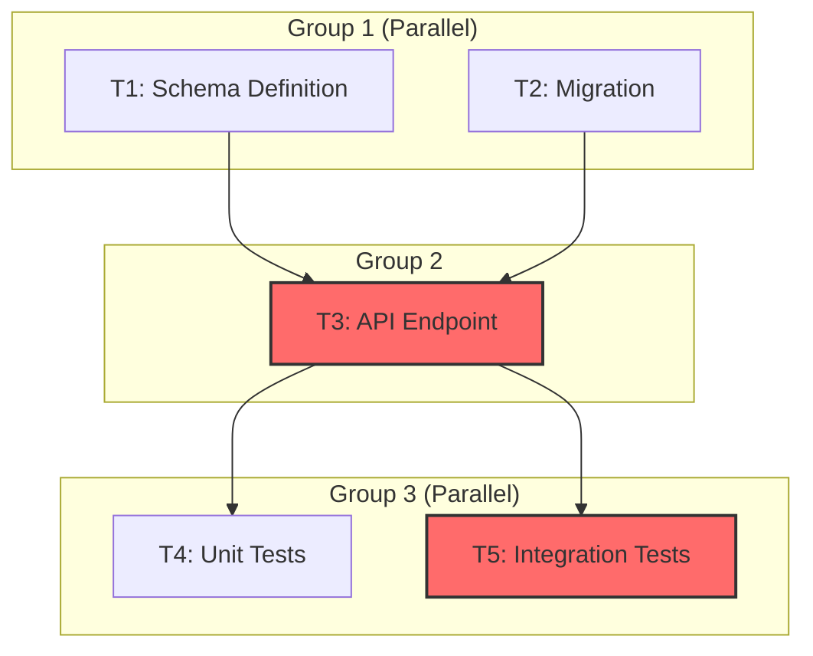

# SESSION PLAN COMMAND

## Purpose

The `/session:plan` command prepares a sprint for implementation by:
1. **Validating prerequisites** (tests, coverage, git status, environment)
2. **Loading minimal context** (CLAUDE.md, sprint plan, git history)
3. **Executing research phase** (understand requirements, identify code locations, select expert agents)
4. **Creating task graph (DAG)** with dependencies, critical path, and parallel groups
5. **Stopping for user review** before implementation begins

This command ensures every sprint has a well-researched, properly-sized task graph that enables efficient parallel or sequential execution.

**Note**: This command replaces the planning portions of the former `/session:start` command. After approval, use `/session:implement` (sequential) or `/session:parallel` (parallel workers) to execute.

---

# PHASE 1: PREREQUISITE VALIDATION (BLOCKING)

**Critical**: All prerequisite checks must PASS before proceeding. If any check FAILS, the command will display what needs fixing and EXIT immediately.

## Step 1A: Test Suite Validation

**Run the complete test suite and verify 100% pass rate**

### Python Projects

```bash
# Run pytest with coverage
pytest --cov=src --cov-report=term-missing --cov-fail-under=80

# Capture results
TEST_EXIT_CODE=$?
```

**Parse output for**:
- Total tests run
- Tests passed
- Tests failed
- Tests skipped
- Overall pass rate

### JavaScript/TypeScript Projects

```bash
# Run npm test with coverage
npm test -- --coverage --passWithNoTests=false

# Or with other package managers
yarn test --coverage
pnpm test --coverage
```

### Validation Logic

```python
# Pseudocode for validation
if TEST_EXIT_CODE != 0:
    print("PREREQUISITE FAILED: Tests are failing")
    print("\nFailing tests must be fixed before starting new work.")
    print("\nRequired Action:")
    print("  1. Fix all failing tests")
    print("  2. Run test suite to verify: pytest --cov=src")
    print("  3. Re-run /session:plan command")
    EXIT_COMMAND()
```

## Step 1B: Coverage Validation

**Verify code coverage meets 80% threshold**

```python
COVERAGE_THRESHOLD = 80

if COVERAGE_PERCENTAGE < COVERAGE_THRESHOLD:
    print(f"PREREQUISITE FAILED: Coverage is {COVERAGE_PERCENTAGE}% (threshold: {COVERAGE_THRESHOLD}%)")
    print("\nRequired Action:")
    print("  1. Add tests to modules below threshold")
    print("  2. Run tests to verify: pytest --cov=src --cov-report=html")
    print("  3. Re-run /session:plan command once coverage >=80%")
    EXIT_COMMAND()
```

## Step 1C: Git Status Validation

**Check for clean git state and potential issues**

```bash
# Check for merge conflict markers
CONFLICT_FILES=$(git diff --name-only --diff-filter=U)

if [ -n "$CONFLICT_FILES" ]; then
    echo "PREREQUISITE FAILED: Merge conflicts detected"
    exit 1
fi

# Get current branch
CURRENT_BRANCH=$(git branch --show-current)

# Get commits ahead/behind main
BRANCH_STATUS=$(git rev-list --left-right --count main...HEAD)
```

## Step 1D: Environment Validation

**Verify development environment is properly configured**

```bash
# Python: Check virtual environment and dependencies
if [ -f "pyproject.toml" ]; then
    if ! poetry check --quiet 2>/dev/null; then
        echo "PREREQUISITE FAILED: Poetry dependencies not installed"
        exit 1
    fi
fi

# JavaScript: Check node_modules
if [ -f "package.json" ]; then
    if [ ! -d "node_modules" ]; then
        echo "PREREQUISITE FAILED: Node modules not installed"
        exit 1
    fi
fi
```

## Step 1E: Validation Summary

```
===============================================
  PREREQUISITE VALIDATION COMPLETE
===============================================

Tests: {PASSED}/{TOTAL} passing (100% pass rate)
Coverage: {COVERAGE_PERCENTAGE}% (threshold: 80%)
Git: {CURRENT_BRANCH} branch, {COMMITS_AHEAD} commits ahead
Environment: Dependencies installed, services ready

Ready to load session context...
```

---

# PHASE 2: CONTEXT LOADING (MINIMAL)

**Goal**: Load essential project context while keeping token usage <30,000 tokens (15% of 200K window)

## Step 2A: Load CLAUDE.md Master File

**Read CLAUDE.md to understand project must-dos, current state, and active sprint**

Extract:
1. MUST DO Rules (TDD requirements, coverage thresholds)
2. Current Status (sprint, story, progress)
3. High-Level Roadmap
4. Environment Details
5. Key Files Reference (indexes)

## Step 2B: Load Next Session Plan (if exists)

**Read state/next_session_plan.md for previous session context**

```bash
if [ -f "state/next_session_plan.md" ]; then
    cat state/next_session_plan.md
fi
```

## Step 2C: Load Git Context (Last 5 Commits)

```bash
# Get last 5 commit messages only (no diffs)
git log --oneline --decorate -n 5

# Get uncommitted changes summary
STAGED=$(git diff --cached --name-only | wc -l)
UNSTAGED=$(git diff --name-only | wc -l)
```

## Step 2C.5: Load Module Registry (if exists)

**Read state/modules_registry.md for quick interface lookups**

```bash
if [ -f "state/modules_registry.md" ]; then
    cat state/modules_registry.md
fi
```

## Step 2D: Display Session Summary

```
===============================================
  SESSION CONTEXT LOADED
===============================================

CURRENT SPRINT
   Sprint: S{XX} "{NAME}" (Day {X}/{Y}, {Z}% complete)
   Story:  {ID} "{TITLE}" ({PTS} pts, {PROGRESS}% complete)

RECENT ACTIVITY (Last 5 commits)
   [commit summaries]

GIT STATUS
   Branch: {BRANCH} ({N} commits ahead of main)

MODULE REGISTRY
   {N} modules, {M} public interfaces

Context loaded: ~14,000 tokens (7% of window)
```

---

# PHASE 3: TASK PLAN LOADING

**Goal**: Load current task plan and identify what to work on

## Step 3A: Locate Task Plan

### Spec-Kit Format (Preferred)

```bash
# Look for spec-kit tasks.md files
TASKS_FILES=$(ls .specify/specs/*/tasks.md 2>/dev/null)

if [ -n "$TASKS_FILES" ]; then
    echo "✅ Spec-kit tasks.md files found:"
    for f in $TASKS_FILES; do
        echo "   - $f"
    done
    # Use the first tasks.md or ask user to select if multiple
    TASK_PLAN="${TASKS_FILES%% *}"
else
    echo "⚠️ No spec-kit tasks.md found, checking legacy format..."
fi
```

### Legacy Format (Fallback)

```bash
# Check for legacy sprint plan format
SPRINT_ID="${session_context[current_sprint_id]}"
SPRINT_PLAN="sprints/sprint_${SPRINT_ID}/sprint_plan.md"

if [ -z "$TASK_PLAN" ] && [ -f "$SPRINT_PLAN" ]; then
    echo "ℹ️ Using legacy sprint plan format: $SPRINT_PLAN"
    echo "   Consider running /project:scrum to generate tasks.md"
    TASK_PLAN="$SPRINT_PLAN"
fi

if [ -z "$TASK_PLAN" ]; then
    echo "ERROR: No task plan found"
    echo "   Run /project:scrum to generate .specify/specs/{feature}/tasks.md"
    exit 1
fi
```

## Step 3B: Read and Parse Task Plan

### Spec-Kit Format (tasks.md)

Extract:
1. Feature Name and References (spec.md, plan.md)
2. Task Graph (Mermaid diagram showing dependencies)
3. Tasks with T-xxx IDs, status, domain, complexity
4. Sprint Allocation (tasks per sprint)
5. Definition of Done

### Legacy Format (sprint_plan.md)

Extract:
1. Sprint Goal
2. Sprint Scope (in/out of scope)
3. User Stories (with status and acceptance criteria)
4. Sprint Velocity

## Step 3C: Identify Current Task

```python
# Spec-kit format: Find task by status
if task_format == "spec-kit":
    in_progress = [t for t in tasks if t.status == "in_progress"]
    if in_progress:
        current_task = in_progress[0]
    else:
        # Find next pending task following dependency order
        pending = [t for t in tasks if t.status == "pending"]
        # Filter to tasks whose dependencies are all completed
        ready = [t for t in pending if all(d.status == "completed" for d in t.dependencies)]
        current_task = ready[0] if ready else None

# Legacy format: Find story by status
else:
    in_progress = [s for s in stories if s.status == "IN_PROGRESS"]
    if in_progress:
        current_task = in_progress[0]
    else:
        next_planned = [s for s in stories if s.status == "PLANNED"]
        current_task = next_planned[0] if next_planned else None
```

## Step 3D: Display Task Context

### Spec-Kit Format Output

```
===============================================
  TASKS LOADED (Spec-Kit Format)
===============================================

FEATURE: {feature_name}
   Spec: .specify/specs/{feature}/spec.md
   Plan: .specify/specs/{feature}/plan.md
   Tasks: {X} total ({Y} pending, {Z} completed)

CURRENT TASK: T-{XXX} "{TITLE}"
   Domain: {backend|frontend|tests}
   Complexity: {simple|standard|complex}
   Status: {pending|in_progress|completed}
   Dependencies: {T-XXX, T-YYY or "none"}

   Files Affected:
   - {file1} (create|modify)
   - {file2} (create|modify)

   Acceptance Criteria:
   [ ] {criterion_1}
   [ ] {criterion_2}

   Tests:
   - {test_file}::{test_function}

   References:
   - Spec: spec.md#{FR-XXX}
   - Plan: plan.md#{Phase-X}
```

### Legacy Format Output

```
===============================================
  SPRINT PLAN LOADED (Legacy Format)
===============================================

SPRINT {XX}: {NAME}
   Goal: {GOAL}
   Progress: {X}/{Y} story points ({Z}% complete)
   Timeline: Day {A} of {B}

CURRENT TASK: {ID} "{TITLE}" ({PTS} pts)

   Remaining Acceptance Criteria:
   [ ] {AC_1}
   [ ] {AC_2}

SPRINT BOUNDARIES
   In Scope: [list]
   Out of Scope: [list]

⚠️ Consider migrating to spec-kit format:
   Run /project:scrum to generate tasks.md
```

---

# PHASE 4: RESEARCH PHASE (AUTO-EXECUTE)

**Goal**: Research how to implement the current task before creating task graph

## Step 4A: Requirement Analysis

Analyze current task requirements from sprint plan acceptance criteria.

## Step 4B: Search for Similar Features

```bash
# Search for existing patterns
grep -r "similar_pattern" src/ --include="*.py"
grep -r "existing_endpoint" src/ --include="*.py"
```

## Step 4C: Identify Feature Placement

Based on patterns found, determine where new code should go.

## Step 4D: Check PRD/SRS Requirements

```bash
# Query indexes for relevant sections
cat state/indexes/prd_index.md | grep -A 3 "relevant_feature"
cat state/indexes/srs_index.md | grep -A 3 "api_spec"
```

## Step 4E: Identify Expert Agents

Determine which expert agents will be needed for implementation.

## Step 4F: Document Research Findings

Create `sprints/sprint_{XX}/research.md` with all findings.

## Step 4G: Research Phase Summary

```
===============================================
  RESEARCH PHASE COMPLETE
===============================================

FINDINGS DOCUMENTED
   File: sprints/sprint_{XX}/research.md

KEY INSIGHTS
   - Similar patterns found in [files]
   - Can reuse [utilities]
   - Need to [enhancements]

FEATURE PLACEMENT
   - Endpoint: [file]
   - Logic: [file]
   - Tests: [file]

EXPERT AGENTS IDENTIFIED
   - {agent_1} ({purpose})
   - {agent_2} ({purpose})
```

---

# PHASE 5: TASK GRAPH GENERATION (ENHANCED)

**Goal**: Create a Directed Acyclic Graph (DAG) of tasks with dependencies, critical path analysis, and parallel groups. Tasks must be sized to complete within agent context limits (~30-50K tokens max per task).

## Step 5A: Task Decomposition

**Break user story into implementable tasks sized for context limits**

### Task Sizing Guidelines

| Complexity | Estimated Tokens | Max Hours | Split Triggers |
|------------|------------------|-----------|----------------|
| Simple | 10-20K | 0.5-1h | - |
| Standard | 20-35K | 1-2h | >3 files |
| Complex | 35-50K | 2-4h | >50K tokens, >4h, multiple concerns |

### Decomposition Algorithm

```python
def decompose_to_tasks(user_story, research_findings):
    """
    Break user story into tasks sized for agent context limits.
    Each task should be completable without context compaction.
    """
    tasks = []

    # 1. Identify distinct work units from acceptance criteria
    for ac in user_story.acceptance_criteria:
        work_units = identify_work_units(ac)
        for unit in work_units:
            task = create_task(unit)
            tasks.append(task)

    # 2. Identify infrastructure/setup tasks
    if research_findings.needs_migration:
        tasks.insert(0, create_migration_task())
    if research_findings.needs_schema_definition:
        tasks.insert(0, create_schema_task())

    # 3. Add test tasks (TDD - tests before implementation)
    for task in [t for t in tasks if t.type == "implementation"]:
        test_task = create_test_task(task)
        tasks.append(test_task)

    # 4. Validate task sizing (30-50K token budget)
    for task in tasks:
        if estimate_tokens(task) > 50000:
            subtasks = split_task(task)
            tasks.remove(task)
            tasks.extend(subtasks)

    return tasks

def estimate_tokens(task):
    """Estimate tokens needed for a task."""
    base_tokens = 5000  # System prompt, context

    # Add tokens for files to read/modify
    for file in task.files_affected:
        file_size = get_file_size(file)
        base_tokens += file_size * 4  # ~4 tokens per character

    # Add tokens for test generation
    if task.type == "test":
        base_tokens += 8000

    # Complexity multiplier
    multiplier = {"simple": 1.0, "standard": 1.5, "complex": 2.0}
    base_tokens *= multiplier.get(task.complexity, 1.0)

    return int(base_tokens)
```

## Step 5B: Dependency Detection

**Detect dependencies between tasks**

### Dependency Types

1. **Finish-to-Start (FS)**: Task B cannot start until Task A finishes (most common)
2. **Start-to-Start (SS)**: Task B can start when Task A starts (parallel with shared setup)
3. **Contract Dependency**: Task depends on interface definition from another task

### Detection Algorithm

```python
def detect_dependencies(tasks, research_findings):
    """
    Detect dependencies using multiple heuristics.
    """
    edges = []

    for task in tasks:
        for other_task in tasks:
            if task.id == other_task.id:
                continue

            # 1. File-based: Task reads file that other creates/modifies
            for file in task.files_to_read:
                if file in other_task.files_to_create or file in other_task.files_to_modify:
                    edges.append({
                        "from": other_task.id,
                        "to": task.id,
                        "type": "FS",
                        "reason": f"Task {task.id} reads {file} created by {other_task.id}"
                    })

            # 2. Type-based: Tests depend on implementation
            if task.type == "test" and other_task.type == "implementation":
                if task.tests_target == other_task.id:
                    edges.append({
                        "from": other_task.id,
                        "to": task.id,
                        "type": "FS",
                        "reason": "Test depends on implementation"
                    })

            # 3. Schema/interface: Implementation depends on schema
            if "schema" in other_task.title.lower() or "interface" in other_task.title.lower():
                if task.domain == other_task.domain and task.type == "implementation":
                    edges.append({
                        "from": other_task.id,
                        "to": task.id,
                        "type": "FS",
                        "reason": "Implementation depends on schema"
                    })

            # 4. Migration: All backend implementation depends on migrations
            if task.type == "migration":
                for impl_task in [t for t in tasks if t.type == "implementation" and t.domain == "backend"]:
                    edges.append({
                        "from": task.id,
                        "to": impl_task.id,
                        "type": "FS",
                        "reason": "Implementation depends on migration"
                    })

    return deduplicate_edges(edges)
```

## Step 5C: Critical Path Calculation

**Find the longest path through the DAG**

```python
def calculate_critical_path(tasks, edges):
    """
    Find critical path using topological sort and longest path.
    """
    # Build adjacency list
    graph = {task.id: [] for task in tasks}
    in_degree = {task.id: 0 for task in tasks}
    durations = {task.id: task.estimated_hours for task in tasks}

    for edge in edges:
        graph[edge["from"]].append(edge["to"])
        in_degree[edge["to"]] += 1

    # Topological sort (Kahn's algorithm)
    queue = [tid for tid, deg in in_degree.items() if deg == 0]
    topo_order = []

    while queue:
        node = queue.pop(0)
        topo_order.append(node)
        for neighbor in graph[node]:
            in_degree[neighbor] -= 1
            if in_degree[neighbor] == 0:
                queue.append(neighbor)

    # Calculate longest path (earliest completion time)
    earliest_finish = {tid: 0 for tid in topo_order}
    predecessor = {tid: None for tid in topo_order}

    for node in topo_order:
        for neighbor in graph[node]:
            if earliest_finish[neighbor] < earliest_finish[node] + durations[node]:
                earliest_finish[neighbor] = earliest_finish[node] + durations[node]
                predecessor[neighbor] = node

    # Find end node (max earliest finish)
    end_node = max(earliest_finish, key=earliest_finish.get)
    total_duration = earliest_finish[end_node] + durations[end_node]

    # Backtrack to find critical path
    critical_path = []
    current = end_node
    while current is not None:
        critical_path.append(current)
        current = predecessor[current]
    critical_path.reverse()

    return {
        "path": critical_path,
        "total_duration_hours": total_duration,
        "tasks_on_path": len(critical_path)
    }
```

## Step 5D: Parallel Group Identification

**Group tasks that can run simultaneously**

```python
def identify_parallel_groups(tasks, edges, critical_path):
    """
    Group tasks by level in DAG (tasks at same level can run in parallel).
    """
    depends_on = {task.id: set() for task in tasks}
    for edge in edges:
        depends_on[edge["to"]].add(edge["from"])

    groups = []
    assigned = set()

    # Level-order traversal
    current_level = 0
    while len(assigned) < len(tasks):
        # Find tasks whose dependencies are all assigned
        available = []
        for task in tasks:
            if task.id in assigned:
                continue
            if depends_on[task.id].issubset(assigned):
                available.append(task.id)

        if not available:
            break

        groups.append({
            "group": current_level + 1,
            "tasks": available,
            "can_parallelize": len(available) > 1,
            "has_critical_path_task": any(t in critical_path["path"] for t in available)
        })

        assigned.update(available)
        current_level += 1

    return groups
```

## Step 5E: Execution Strategy Recommendation

**Analyze task graph and recommend parallel vs sequential execution**

```python
def recommend_execution_strategy(tasks, parallel_groups, critical_path):
    """
    Recommend /session:parallel or /session:implement based on graph analysis.
    """
    total_tasks = len(tasks)
    parallelizable_tasks = sum(len(g["tasks"]) for g in parallel_groups if g["can_parallelize"])
    parallelization_efficiency = parallelizable_tasks / total_tasks if total_tasks > 0 else 0

    total_hours = sum(t.estimated_hours for t in tasks)
    critical_path_hours = critical_path["total_duration_hours"]
    speedup_factor = total_hours / critical_path_hours if critical_path_hours > 0 else 1

    # Recommendation logic
    if total_tasks >= 5 and parallelization_efficiency >= 0.4 and speedup_factor >= 1.5:
        recommendation = {
            "strategy": "/session:parallel",
            "reason": f"{parallelization_efficiency:.0%} parallelization, {speedup_factor:.1f}x speedup potential",
            "recommended_workers": min(3, max(2, len([g for g in parallel_groups if g["can_parallelize"]])))
        }
    else:
        recommendation = {
            "strategy": "/session:implement",
            "reason": f"Small sprint ({total_tasks} tasks) or limited parallelization ({parallelization_efficiency:.0%})",
            "recommended_workers": 1
        }

    return {
        "recommendation": recommendation,
        "metrics": {
            "total_tasks": total_tasks,
            "parallelization_efficiency": parallelization_efficiency,
            "speedup_factor": speedup_factor,
            "critical_path_hours": critical_path_hours,
            "total_sequential_hours": total_hours
        }
    }
```

## Step 5F: Output Generation

**Create task graph files**

### 1. Task Graph Markdown (`sprints/sprint_XX/task_graph.md`)

```markdown
# Task Graph: Sprint {XX} - {Sprint Name}

**Generated**: {TIMESTAMP}
**Total Tasks**: {N}
**Estimated Duration**: {X} hours (sequential) / {Y} hours (parallel)
**Critical Path Duration**: {Z} hours
**Parallelization Efficiency**: {W}%

## Recommended Execution Strategy

**{/session:parallel | /session:implement}**
Reason: {explanation}

## Visual DAG (Mermaid)



## Critical Path

**Duration**: {X} hours
**Tasks**: {N} tasks

| Order | Task ID | Title | Duration | Cumulative |
|-------|---------|-------|----------|------------|
| 1 | T-001 | {title} | {time} | {cumulative} |
| 2 | T-002 | {title} | {time} | {cumulative} |

## Parallel Groups

### Group 1 (Can Run Simultaneously)
- **T-001**: {title} ({time}) - {domain}
- **T-002**: {title} ({time}) - {domain} [CRITICAL PATH]

### Group 2 (Depends on Group 1)
- **T-003**: {title} ({time}) - {domain} [CRITICAL PATH]

## Task Details

### T-001: {Title}
- **ID**: T-001
- **Domain**: {backend|frontend|tests}
- **Complexity**: {simple|standard|complex}
- **Estimated Tokens**: {N}
- **Estimated Duration**: {X} hours
- **Dependencies**: {None | T-XXX, T-YYY}
- **Parallel Group**: {N}
- **On Critical Path**: {Yes|No}
- **Expert Agent**: {agent-name}
- **Files Affected**:
  - `{path}` ({create|modify})
- **Acceptance Criteria**:
  - {criterion_1}
  - {criterion_2}
- **Tests**:
  - {test_function_1}
  - {test_function_2}

[Repeat for each task]

## Contract-First Opportunities

Tasks that define interfaces others depend on:
- **T-001** (Schema Definition): Enables T-003 to implement against defined contract
- Consider: Frontend can mock T-001's interface while backend implements

## Risk Assessment

| Risk | Severity | Mitigation |
|------|----------|------------|
| Critical path too long | {severity} | {mitigation} |
| Token budget exceeded | {severity} | {mitigation} |

## User Review Checkpoint

**ACTION REQUIRED**: Review this task graph before proceeding.

Questions for review:
1. Are all dependencies correctly identified?
2. Is the critical path acceptable for timeline?
3. Are there opportunities to parallelize further?
4. Should any complex tasks be split?

**Commands**:
- `/session:implement` - Execute tasks sequentially
- `/session:parallel` - Execute with parallel workers (recommended: {N} workers)
- `/session:plan --refresh` - Regenerate this plan
```

### 2. Task Graph JSON (`sprints/sprint_XX/task_graph.json`)

```json
{
  "version": "1.0.0",
  "sprint_id": "05",
  "sprint_name": "User Management",
  "generated_at": "2025-01-15T10:00:00Z",

  "summary": {
    "total_tasks": 7,
    "total_sequential_hours": 4.5,
    "critical_path_hours": 3.5,
    "parallelization_efficiency": 0.67,
    "recommended_strategy": "/session:parallel",
    "recommended_workers": 3
  },

  "tasks": {
    "T-001": {
      "id": "T-001",
      "title": "Define Pydantic Schemas",
      "description": "Create request/response models",
      "domain": "backend",
      "complexity": "simple",
      "estimated_tokens": 15000,
      "estimated_hours": 0.5,
      "dependencies": [],
      "dependents": ["T-003"],
      "acceptance_criteria": [
        "ResetPasswordRequest model with token and new_password",
        "Field validation (min length 8 chars)"
      ],
      "files_affected": [
        {"path": "src/schemas/auth.py", "operation": "modify"}
      ],
      "expert_agent": "fastapi-expert",
      "parallel_group": 1,
      "on_critical_path": false,
      "srs_ref": "L234-289",
      "ui_ref": null,
      "tests": {
        "file": "tests/test_schemas.py",
        "functions": ["test_reset_request_validation"]
      }
    }
  },

  "critical_path": {
    "task_ids": ["T-002", "T-003", "T-005", "T-006"],
    "total_hours": 3.5,
    "bottleneck_task": "T-003"
  },

  "parallel_groups": [
    {"group": 1, "tasks": ["T-001", "T-002", "T-004"], "can_parallelize": true},
    {"group": 2, "tasks": ["T-003"], "can_parallelize": false},
    {"group": 3, "tasks": ["T-005"], "can_parallelize": false},
    {"group": 4, "tasks": ["T-006", "T-007"], "can_parallelize": true}
  ],

  "edges": [
    {"from": "T-001", "to": "T-003", "type": "FS", "reason": "Schema required for endpoint"},
    {"from": "T-002", "to": "T-003", "type": "FS", "reason": "Migration required"}
  ],

  "execution_metadata": {
    "started_at": null,
    "last_checkpoint": null,
    "tasks_completed": 0,
    "tasks_failed": 0,
    "resume_from": null
  }
}
```

## Step 5G: USER REVIEW CHECKPOINT (STOP)

**Display summary and STOP for user approval**

```
===============================================
  PLANNING COMPLETE - AWAITING USER REVIEW
===============================================

TASK GRAPH GENERATED
   Markdown: sprints/sprint_{XX}/task_graph.md
   JSON: sprints/sprint_{XX}/task_graph.json

SUMMARY
   Tasks: {N} | Sequential: {X}h | Parallel: {Y}h
   Critical Path: {Z}h ({M} tasks)
   Parallelization: {W}%

CRITICAL PATH
   {T-001} -> {T-002} -> {T-003} -> {T-004}

PARALLEL OPPORTUNITIES
   Group 1: {tasks} can run simultaneously
   Group 2: {tasks} can run simultaneously

RECOMMENDED STRATEGY
   {/session:parallel | /session:implement}
   Reason: {explanation}

===============================================
  ACTION REQUIRED: Review task_graph.md
===============================================

Commands:
  /session:implement    Execute tasks sequentially
  /session:parallel     Execute with {N} parallel workers
  /session:plan --refresh  Regenerate this plan

===============================================
```

**STOP HERE - Do not proceed to implementation until user approves.**

---

# ARGUMENTS

```
/session:plan [sprint-number] [--refresh] [--skip-validation]
```

- `sprint-number`: Sprint to plan (e.g., `3` for sprint 3). Default: detect from `state/current_state.md`
- `--refresh`: Regenerate task graph even if one exists
- `--skip-validation`: Skip prerequisite validation (use with caution)

---

# OUTPUT FILES

| File | Purpose |
|------|---------|
| `sprints/sprint_XX/research.md` | Research findings from Phase 4 |
| `sprints/sprint_XX/task_graph.md` | Human-readable task graph with Mermaid diagram |
| `sprints/sprint_XX/task_graph.json` | Machine-readable task graph for execution commands |

---

# NEXT STEPS AFTER APPROVAL

After reviewing the task graph:

1. **For parallel execution** (recommended for larger sprints):
   ```
   /session:parallel
   ```
   - Reads `task_graph.json`
   - Creates GitLab issues from task graph
   - Spawns continuous worker pool (up to 3 workers)
   - Merges completed work automatically

2. **For sequential execution** (smaller sprints or tightly coupled tasks):
   ```
   /session:implement
   ```
   - Reads `task_graph.json`
   - Executes tasks one at a time in dependency order
   - Creates GitLab issues as tasks start
   - Supports checkpoint-based resumption

---

# TOKEN BUDGET

| Phase | Tokens | Cumulative |
|-------|--------|------------|
| Phase 1: Validation | ~2,000 | ~2,000 |
| Phase 2: Context Loading | ~12,000 | ~14,000 |
| Phase 3: Sprint Plan | ~5,000 | ~19,000 |
| Phase 4: Research | ~20,000 | ~39,000 |
| Phase 5: Task Graph | ~10,000 | ~49,000 |

**Total**: ~49,000 tokens (25% of 200K window)
**Remaining for execution**: ~151,000 tokens
